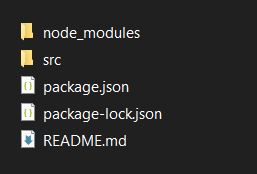

# OmegleMe bot
This is a simple chat bot for [OmegleMe](https://omegleapp.me/), implemented using Puppeteer. The bot automatically interacts with strangers in chat rooms, sending pre-defined messages based on certain conditions.

## Features
- **Automated Messaging**: Sends greeting, asking, giving, and ending messages to strangers.
- **Blacklisted Replies**: Skips strangers who reply with blacklisted messages.
- **Typing Simulation**: Mimics human typing with configurable typing delays.
- **Message Checking**: Ensures that messages are not repeated by tracking previously checked replies.
- **Skip Functionality**: Automatically skips strangers who don't respond or provide undesirable replies.

## Requirements
- [Node.js](https://nodejs.org/en/download/prebuilt-installer)
- [Git](https://git-scm.com/downloads)

## Installation
1. clone the repository (open cmd and type the following one by one)
```bash
cd desktop

git clone https://github.com/Iratethisname10/omegleapp-bot
```

2. download dependencies (type the following one by one into cmd)
```bash
cd omegleapp-bot

npm install puppeteer
```

3. your file structure should look like this


4. Open the `main.js` file from the `src` folder and configure the config
```js
const config = {
	// all messages can be arrays (recommended)
	greeting_message: 'hi there',
	asking_message: 'do you wanna add my discord lol',
	giving_message: 'alr its cheese',
	ending_message: 'byeeee',

	send_giving_and_ending_message_together: true,

	blacklisted_replies: ['bot?', 'i hate cheese'], // if the strager says this, skip them

	typing_delay: 10, // the delay inbetween typing character (ms)

	max_wait_time: 30 // if the stranger dosnt reply within this time, skip them (seconds)
};
```

5. type `node main.js` into cmd and the bot should start!

## Disclaimer
Please be respectful while using the bot. Do not spam or harass users. Use at your own risk, as automating interactions may violate their terms of service.

## Contact
For any questions or support, please contact `__vocat` on discord.